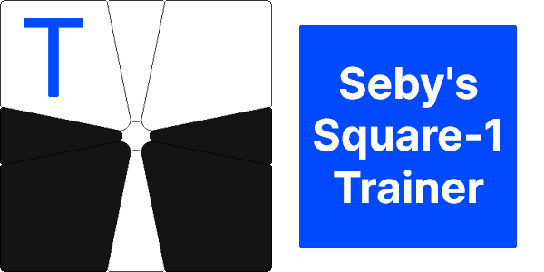

This is a web app that will be used for you to train all things Square-1!

_Eventually._

I've never made a program like this, or a website/web app in general, so it will probably take a long time and be badly coded, but whatever works works right?

This program was inspired by [Squanmate](https://github.com/sp3ctum/squanmate), which is unfortunately not being maintained anymore.

**Thank you, Squanmate!**
